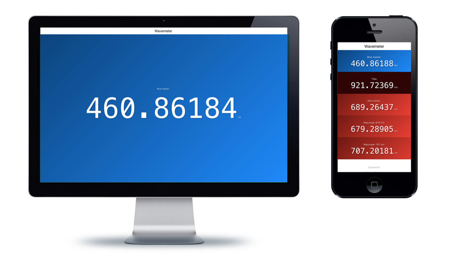

# py-ws7 – minimal wavemeter webserver

py-ws7 is a very simple python webserver that allows to get the wavelength from the High Finesse Angstrom WS7 wavemeter and send it to any computer or phone in your network. Multichannel switch is also supported.

You can have a look at the interface on a [demo page](https://wavemeter.quantumgear.io/demo/).



## Features

- Mobile and desktop friendly webserver
- Minimal python module to work with `wlmData.dll` library
- Simple HTTP API to get data (for example, with [requests](http://docs.python-requests.org/en/master/))
- Flexible configuration
- Javascript library to embed realtime wavelength value in your pages

## Quick start

Server works on both python2.7 and python3.5. The only dependence is [tornado framework](http://www.tornadoweb.org/en/stable/). You can install it via:

```
pip install tornado
```

To start the server, you will need:

- Windows computer with High Finesse software installed and running
- Python 2 or Python 3

Just run in the command line:

```
python server.py
```

Web interface will be available on [http://localhost:8000](http://localhost:8000)

## Configuration

Server uses three sources of the configuration. Default configuration hardcoded in the `server.py`, configuration file (`config.json` by default or set by `-c` argument) and command line arguments.

Configuration file overwrites default config, command line arguments overwrite everything. This means that even if in the config file you have `"debug": True`, running script with `--debug` flag will start it in the debug mode. The same is applied to the port number.

### Config file

In the project folder there is an example configuration file `config-example.json` where you can see how to set desired channels, labels and custom background. By default server will try to load `config.json` file in the same folder.

Configuration file looks like this:

```json
{
  "precision": 5,
  "port": 8000,
  "channels": [
    { "i": 0, "label": "Blue master"},
    {
      "i": 4,
      "label": "TiSa",
      "background": "#300"
    },
    { "i": 1, "label": "Red master"},
    { "i": 2, "label": "Repumper 679 nm"},
    { "i": 3, "label": "Repumper 707 nm"}
  ],
  "root": "/"
}
```
**Precision** defines number of decimal digits displayed in the wavelength value. For `"precision": 5` you will get something like **460.86180**.

**Port** defines http port to listen to. By default the web interface will be available on [http://localhost:8000/](http://localhost:8000/), if you want to get it on [http://localhost/](http://localhost/) set port to **80**. Alternatively you can use Apache or Nginx to route certain requests to the wavemeter server.

**Channels** is an array of wavemeter channels that you are interested in. You can leave only channels that you are using to make interface cleaner. Every channel can have a **label** and if you are not happy with default background calculated from the wavelength — custom **background**.

**Root** defines url where you want to get the wavemeter. For example, if you want to make it available on [http://localhost:8000/wavemeter/](http://localhost:8000/wavemeter/) set `"root": "/wavemeter/"`.

### Flags

To find out possible command line arguments run:

```
python server.py -h
```

Flag `--debug` starts the server in debug mode so you can see what it looks like without wavemeter, also on linux or mac computer.

To run server on 80 port (default http port) run:

```
python server.py 80
```

To make the server available not on localhost:8000/ but on localhost:8000/wlm/ add a flag `-r` or `--root` with desirable root path.

This command will run server on localhost:80/wlm/ in debug mode with config file loaded from `~/wlm_config.json/`:

```
python server.py --debug -c ~/wlm_config.json -r /wlm/ 80
```

## HTTP API

When server is running you can get wavelengths in json format by simple http requests.

Try adding [/api/](http://localhost:8000/api/) to the url, or [/api/3/](http://localhost:8000/api/3/) to get wavelength of corresponding channel (channels here start from 0).

## Javscript library `wlm.js`

You can insert real-time wavelength from the wavemeter in any http page. It is quite useful when you have a web control interface of the laser and want to see the wavelength during adjustments.

To start working with it you need to include the library and initialize it with several options:

```html
<script src="http://localhost:8000/static/wlm.js"></script>
<script type="text/javascript">
	wlm = Wavemeter({
		"url": "http://localhost:8000/", // defines url to connect
		"precision": 5, // defines representation of the wavelength
		"channels": [ // array of channels and element's ids
			{ "channel": 0, "element": "mydiv"},
			{ "channel": 3, "element": "myotherdiv"},
		]
	});
	wlm.start();
</script>
```

After that wavelength values of channel 0 and 3 will be putted in elements with ids `mydiv` and `myotherdiv`. Wavelengths are also available from javascript as `wlm.wavelengths`.

You can also ask the library to call a custom function every time it gets new data. For example, the following code will write "Resonant" in a div with `id="status"` if wavelength of the 4th channel is close to 707.2017 or "Detuned" otherwise.

```javascript
wlm.onupdate(function(data){
	var w = data[3];
	if(Math.abs(w-707.2017)<0.0001){
		document.getElementById("status").innerHTML = "Resonant";
	}else{
		document.getElementById("status").innerHTML = "Detuned";
	}
});
```

If you want to indicate disconnect event, there is a function for that:

```javascript
wlm.onclose(function(){
	document.getElementById("status").innerHTML = "No connection";
});
```

Example page can be found at [http://localhost:8000/static/wlmjs_test.html](http://localhost:8000/static/wlmjs_test.html).

# Minimal python module `wlm.py`

Simplest example:

```python
from wlm import *

wlm = WavelengthMeter()

for i, v in enumerate(wlm.wavelengths):
    print("Wavelength at channel %d:\t%.4f nm" % (i, v))
```

## `WavelengthMeter` class constructor

WavelengthMeter class accepts two optional arguments:
- `dllpath` - path to the `wlmData.dll`. Default is `C:\Windows\System32\wlmData.dll`
- `debug` - partially emulates work of the dll library without accessing it, default is `False`

## Class properties

- `wavelengths` - array of all wavelengths (from channel 1 to 8)
- `wavelength` - wavelength of the first channel
- `switcher_mode` - set to True if you want to measure all channels, set to False to measure only active channel

